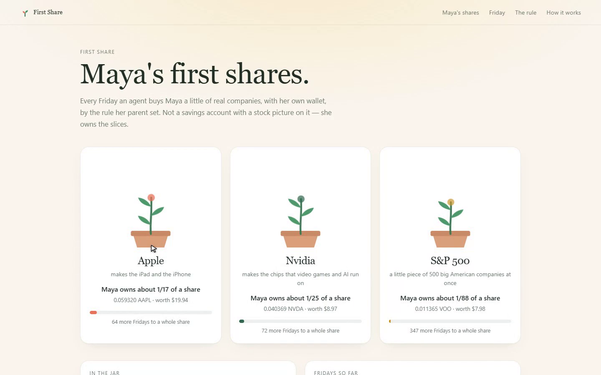
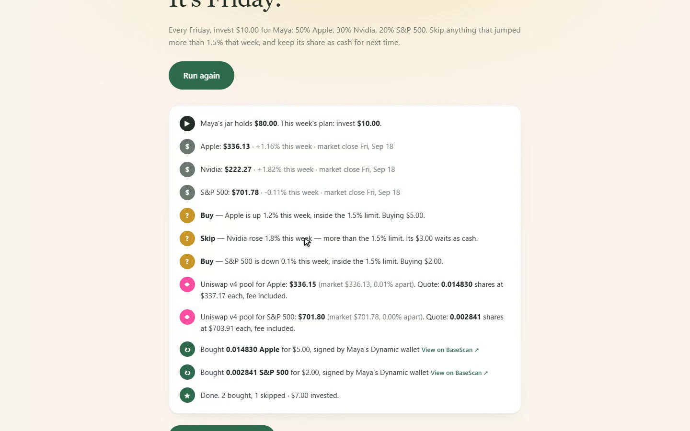
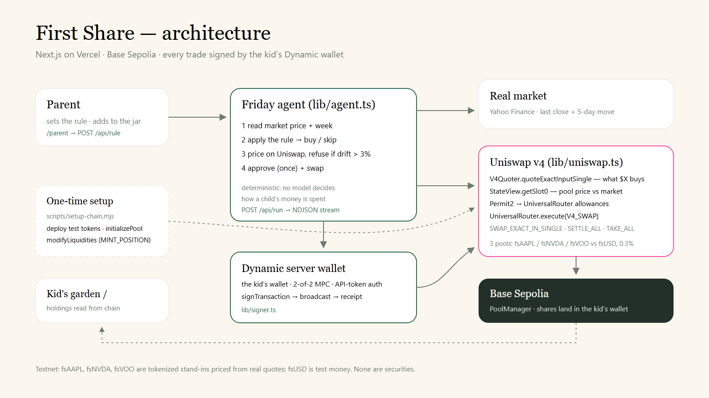

# First Share

**Give a kid their first stocks.** Every Friday, an agent with the kid's own wallet buys a little of
real companies — as tokenized stocks on Uniswap v4 — by the rule a parent set.

**Live demo: [first-share.vercel.app](https://first-share.vercel.app)** — a Friday run there makes
real swaps on Base Sepolia. · **Video: [youtu.be/yWM5jpcK2Y0](https://youtu.be/yWM5jpcK2Y0)**

Built for [Runtime](https://runtime.nyc/) — Uniswap track, Dynamic track, and the Bankr grand prize.



---

## The problem

Owning a piece of the economy starts at home — or it doesn't.

- **62%** of Americans own stock, but that splits hard by income: **87%** of adults in households
  earning $100,000 or more, and **28%** in households earning under $50,000.
  — Gallup, [*What Percentage of Americans Own Stock?*](https://news.gallup.com/poll/266807/percentage-americans-owns-stock.aspx), May 5 2025 (income split from combined 2024–25 data)
- The U.S. now agrees the habit should start at birth: every child born 2025–2028 gets a **$1,000**
  Treasury deposit, *"immediately invested in an index fund"*, with family able to add up to $5,000 a
  year from July 4, 2026.
  — [U.S. Treasury, Jan 28 2026](https://home.treasury.gov/news/press-releases/sb0372) · [IRS IR-2026-31](https://www.irs.gov/newsroom/treasury-irs-issue-proposed-regulations-for-trump-accounts-contribution-pilot-program-treasury-department-to-deposit-1000-into-the-account-of-each-eligible-child)

A kid's first share usually depends on a grown-up remembering, having a brokerage account, and
buying whole shares they can't afford. Tokenized stocks remove the last two. First Share removes the
first: a parent writes the rule once, and an agent keeps it every Friday.

## What it does

1. **The parent sets a rule** (`/parent`): how much each Friday, how to split it between stocks, and
   "skip anything that jumped more than X% this week". It's shown back in plain English before saving.
2. **On Friday, the agent runs** (`/friday`), streaming every step:
   - reads each stock's **real** last close and its move over the week,
   - applies the rule — buy, or **skip** a stock that rose past the limit and keep its share as cash,
   - prices every buy on its **Uniswap v4 pool**, and **refuses** if the pool has drifted more than 3%
     from the real market,
   - signs the swaps with the **kid's own Dynamic wallet**, and links each one to BaseScan.
3. **The kid sees a garden** (`/`): a plant per company that grows toward a whole share, in words a
   kid can picture — *"about 1/67 of an Apple share · 66 more Fridays to a whole one"*.

**What the human still decides:** the amount, the split and the limit. The agent can't spend more,
buy anything else, or trade at a price the pool can't justify. No model decides how a child's money
is spent — the decision logic is plain code ([`lib/rules.ts`](lib/rules.ts)) and every decision is
shown on screen.



---

## How we use the sponsors

### Uniswap v4 — pools, quotes and swaps

All Uniswap code is in two files. Contract addresses: [`lib/deployments.json`](lib/deployments.json)
(v4 PoolManager, PositionManager, UniversalRouter, V4Quoter, StateView and Permit2 on Base Sepolia,
from the official deployments page).

| What | Where |
|---|---|
| Create each pool at the stock's real last close — `PositionManager.initializePool` | [`scripts/setup-chain.mjs` L183](scripts/setup-chain.mjs#L183) · price math [L108](scripts/setup-chain.mjs#L108) |
| Add full-range liquidity — `PositionManager.modifyLiquidities` with `MINT_POSITION` + `SETTLE_PAIR` | [`scripts/setup-chain.mjs` L207–L218](scripts/setup-chain.mjs#L207-L218) |
| Quote what $X buys — `V4Quoter.quoteExactInputSingle` | [`lib/uniswap.ts` L53](lib/uniswap.ts#L53) |
| Read the pool's price to check it against the market — `StateView.getSlot0` | [`lib/uniswap.ts` L64](lib/uniswap.ts#L64) |
| The swap — `UniversalRouter.execute(V4_SWAP)` with `SWAP_EXACT_IN_SINGLE`, `SETTLE_ALL`, `TAKE_ALL` | [`lib/uniswap.ts` L82](lib/uniswap.ts#L82) · command/actions [L44–L45](lib/uniswap.ts#L44-L45) |
| One-time allowances — ERC-20 → Permit2 → UniversalRouter | [`lib/uniswap.ts` L105](lib/uniswap.ts#L105) |
| The pool-vs-market guard that refuses bad prices | [`lib/agent.ts` L45–L55](lib/agent.ts#L45-L55) |

Three pools, 0.30% fee, tick spacing 60, no hooks: **fsAAPL/fsUSD, fsNVDA/fsUSD, fsVOO/fsUSD** —
tokenized stand-ins for Apple, Nvidia and an S&P 500 fund, against a test dollar. Pool IDs are in
[`lib/deployments.json`](lib/deployments.json). Our developer feedback is in [FEEDBACK.md](FEEDBACK.md).

### Dynamic — the kid's wallet, and the agent's hands

**Wallet pattern: server wallet.** Each kid's wallet is a Dynamic server wallet owned by the app's
developer account; the agent authenticates with an API token and signs with the wallet's password.
It's 2-of-2 MPC with key shares backed up to Dynamic, so no raw private key exists on the server.

- The decision → action path: [`lib/agent.ts` L25](lib/agent.ts#L25) decides, then
  [`lib/signer.ts` L67 `sendFromKid`](lib/signer.ts#L67) signs (`DynamicEvmWalletClient.signTransaction`),
  broadcasts and waits for the receipt.
- Wallet creation: [`scripts/wallet.mjs`](scripts/wallet.mjs) (`createWalletAccount`, `TWO_OF_TWO`,
  backed up to Dynamic).
- Dynamic's signer runs on Linux and macOS only; [`lib/signer.ts` L23](lib/signer.ts#L23) makes the
  app say "signing unavailable" anywhere else rather than pretend.

### Bankr — onchain equities

Every Runtime entry is eligible for the Bankr grand prize, which gives bonus consideration to
onchain equities. First Share is an onchain-equities product for the people with the least access to
equities today: children, a few dollars at a time.



---

## What is live, and what isn't

| | |
|---|---|
| Market prices | **Live** — Yahoo Finance last close and 5-day move ([`lib/prices.ts`](lib/prices.ts)). |
| Uniswap v4 pools, quotes and swaps | **Live** on Base Sepolia testnet. |
| Kid wallet signing | **Live** — Dynamic server wallet, on the deployed app. |
| The stocks | **Test tokens** (fsAAPL, fsNVDA, fsVOO) standing in for tokenized stocks, priced from the real close. **Not securities.** |
| The money | **Test dollars** (fsUSD). A parent "deposit" mints them on testnet; in production it would be a USDC transfer. |
| Pool prices over time | Pools were seeded at Friday Sept 18's close and only move with trades, so after a big real-market move the agent's guard will (correctly) refuse to buy until the pool is rebalanced. |
| Demo state | The rule and run log live in a JSON file (`/tmp` on Vercel, so per-instance). Holdings are always read from chain. |

"Maya" is fictional. Built from scratch during the hackathon;
[Claude Code](https://claude.com/claude-code) was used as a coding assistant, and the video's
narration was generated with ElevenLabs.

## Run it locally

```bash
pnpm install
pnpm build && pnpm start      # http://localhost:3000 — reads the deployed pools
```

It runs with no configuration: pages, prices and pools are all readable. To trade, set in `.env`:
`DYNAMIC_ENV_ID`, `DYNAMIC_API_TOKEN`, then `pnpm wallet create` (writes the kid wallet into `.env`)
and `pnpm wallet fund` (needs `DEPLOYER_PRIVATE_KEY`, the owner of the test tokens). Signing needs
Linux or macOS (use WSL on Windows).

To deploy your own tokens and pools: `pnpm compile && pnpm setup:chain` with a funded
`DEPLOYER_PRIVATE_KEY`; it's resumable and writes `lib/deployments.json`.

## License

[MIT](LICENSE)
